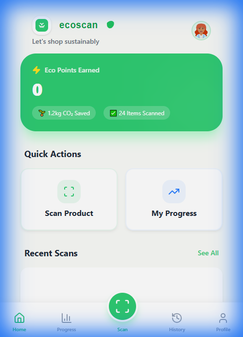
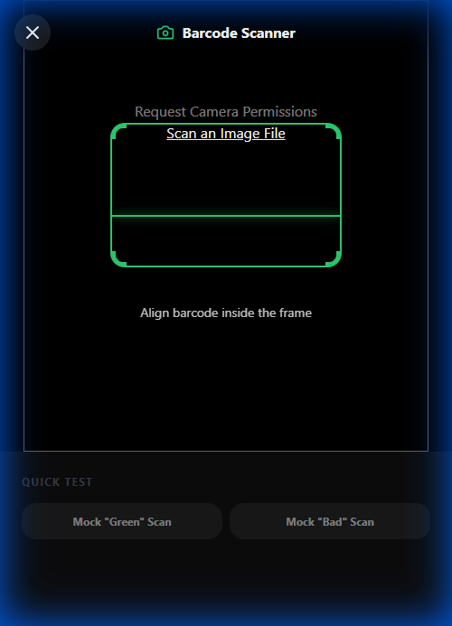
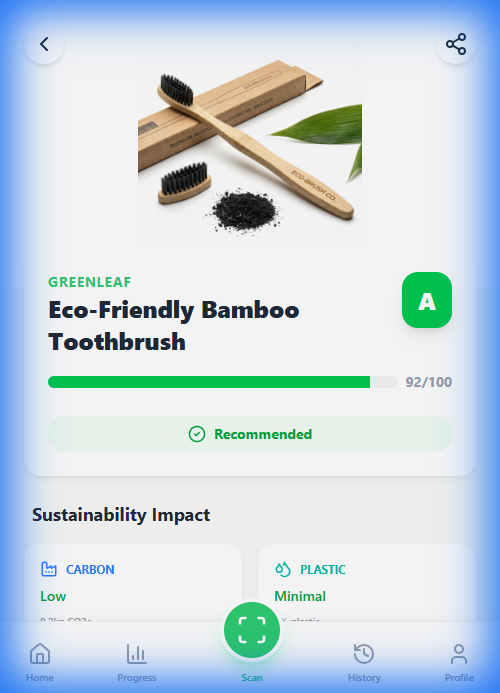
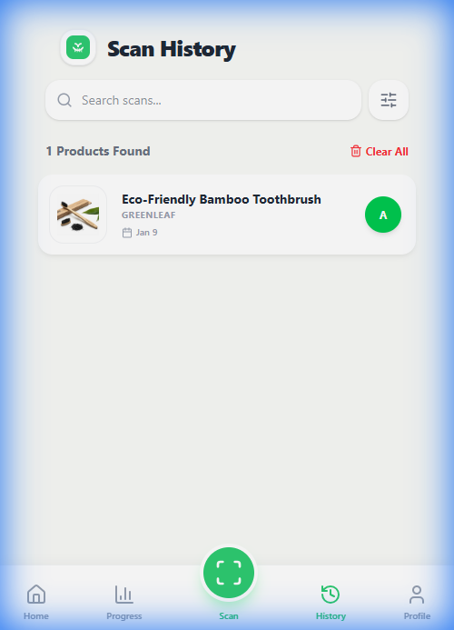
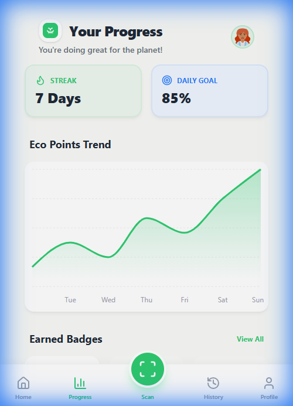
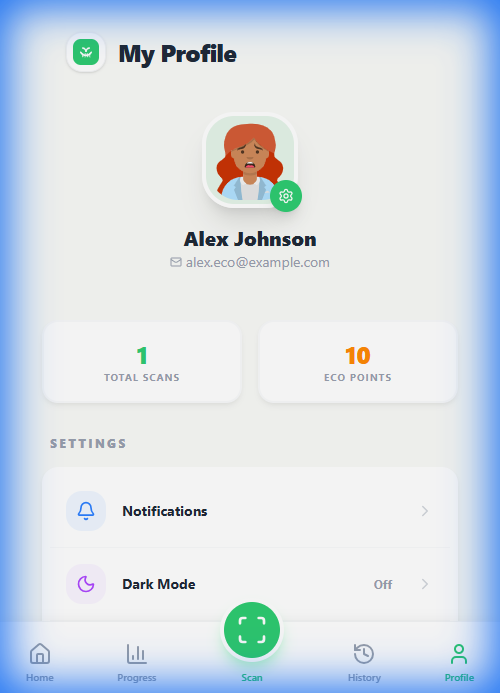

# 🌱 EcoScan – Sustainable Shopping Assistant

<div align="center">


### 🚀 [Live Demo](https://sustainable-shopping-assistant-jblfx4r0b.vercel.app) | 📦 [GitHub Repository](https://github.com/selvaganapathycoder/Sustainable-Shopping-Assistant)

**A professional, mobile-first web application that empowers users to make sustainable shopping choices using real-time product data.**

</div>

---

## 📱 Project Overview

EcoScan is a modern sustainability tracking platform designed to simplify eco-conscious shopping. By integrating the **Open Food Facts API**, the application provides instant sustainability analysis, carbon footprint insights, and ethical scoring for thousands of products via barcode scanning.

### ✨ Core Features

- **🔍 Intelligent Barcode Scanner**: Powered by `html5-qrcode` for instant, camera-based product identification.
- **📊 Real-time Sustainability Scoring**: Comprehensive 0-100 scores based on packaging, carbon impact, and ethical sourcing fetched directly from global databases.
- **📈 Impact Dashboard**: Personalized tracking of environmental contributions and CO₂ savings.
- **📜 Smart History**: Persistent local storage of scan history with full search and filter capabilities.
- **🌗 Native Dark Mode**: fully responsive, premium UI with seamless theme switching and smooth Framer Motion animations.

---

## 📸 Project Screenshots

<div align="center">
  <table style="width: 100%; border-collapse: collapse; border: none;">
    <tr>
      <td align="center" style="width: 33.33%; border: none;">
        <br/>
        <b>🏠 Home Dashboard</b>
      </td>
      <td align="center" style="width: 33.33%; border: none;">
        <br/>
        <b>🔍 Smart Scanner</b>
      </td>
      <td align="center" style="width: 33.33%; border: none;">
        <br/>
        <b>📊 Product Insights</b>
      </td>
    </tr>
    <tr>
      <td align="center" style="width: 33.33%; border: none;">
        <br/>
        <b>📜 Scan History</b>
      </td>
      <td align="center" style="width: 33.33%; border: none;">
        <br/>
        <b>📈 Impact Tracking</b>
      </td>
      <td align="center" style="width: 33.33%; border: none;">
        <br/>
        <b>👤 User Profile</b>
      </td>
    </tr>
  </table>
</div>

---


## 🛠️ Technical Excellence

- **Modern Architecture**: Built with **React 19** and **TypeScript** for robust, state-of-the-art frontend development.
- **API First**: Seamless integration with the **Open Food Facts REST API** for real-world data accuracy.
- **Performance Optimized**: Lightning-fast builds via **Vite**, with code-splitting and efficient local data caching.
- **Premium UI/UX**: Developed with **Tailwind CSS** and **Framer Motion** for a high-end, native-app feel.

---

## 🚀 Getting Started

```bash
# Clone the repository
git clone https://github.com/selvaganapathycoder/Sustainable-Shopping-Assistant.git

# Install dependencies
npm install

# Run development server
npm run dev
```

---

## 👨‍💻 Developed by

**Selvaganapathy**
- **GitHub**: [@selvaganapathycoder](https://github.com/selvaganapathycoder)
- **LinkedIn**: [Selvaganapathy](https://www.linkedin.com/in/selva-ganapathy-developer)
- **Live Demo**: [EcoScan Live](https://sustainable-shopping-assistant-jblfx4r0b.vercel.app)

---

<div align="center">

**Built with a focus on clean code, real-world utility, and sustainability. 🌍**

</div>
